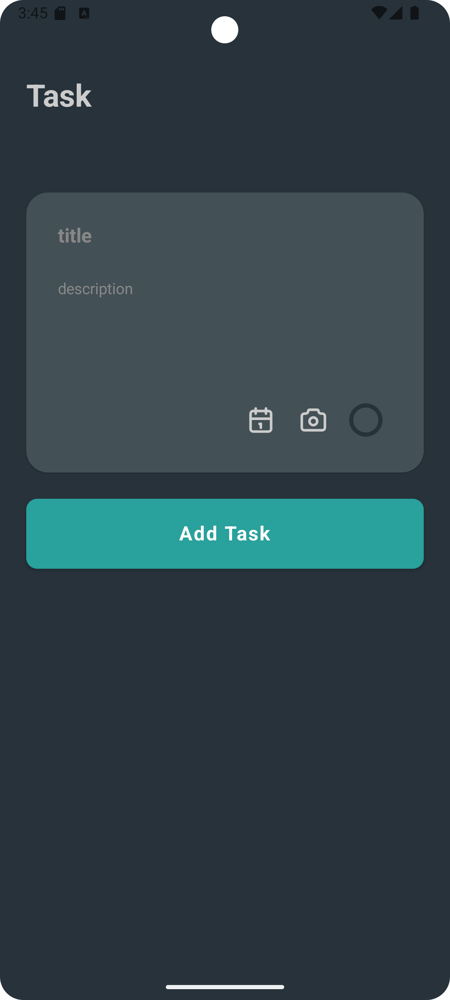
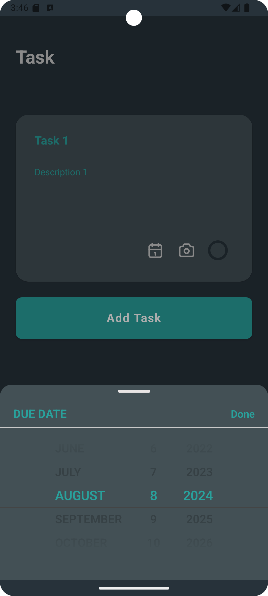
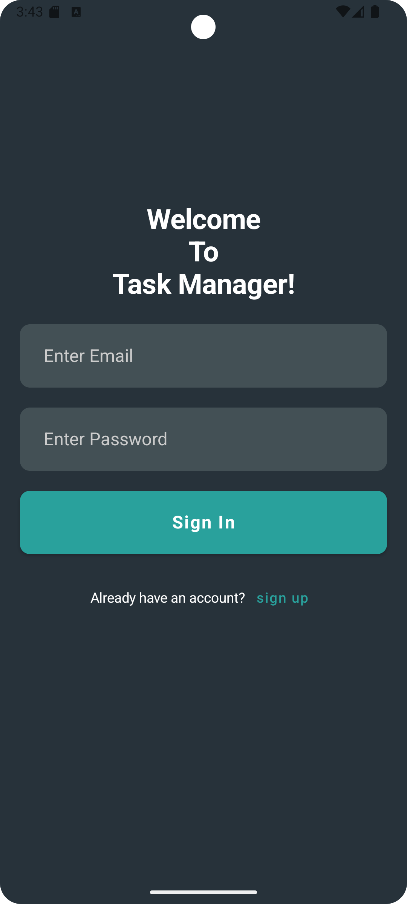
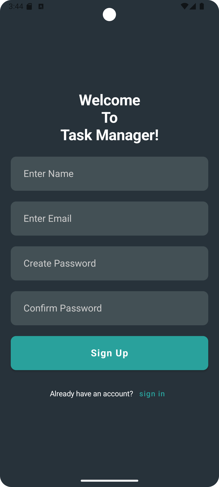
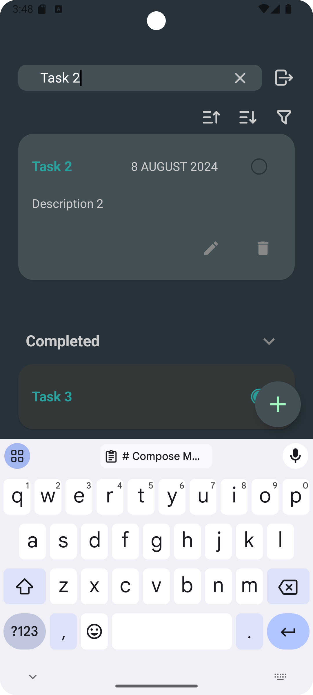
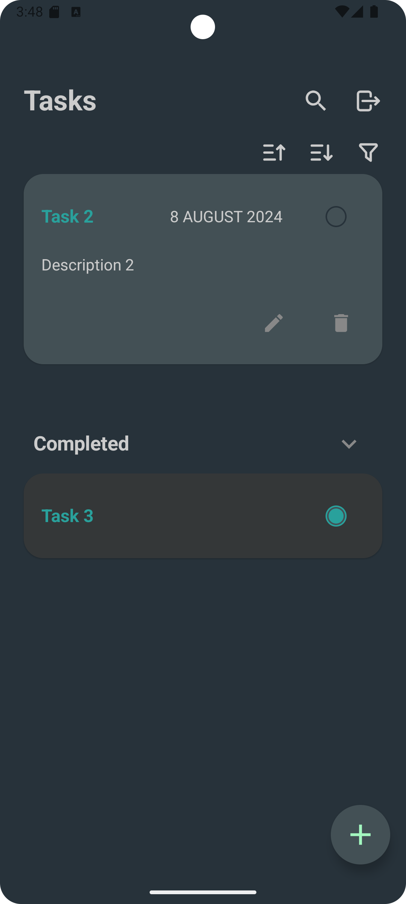
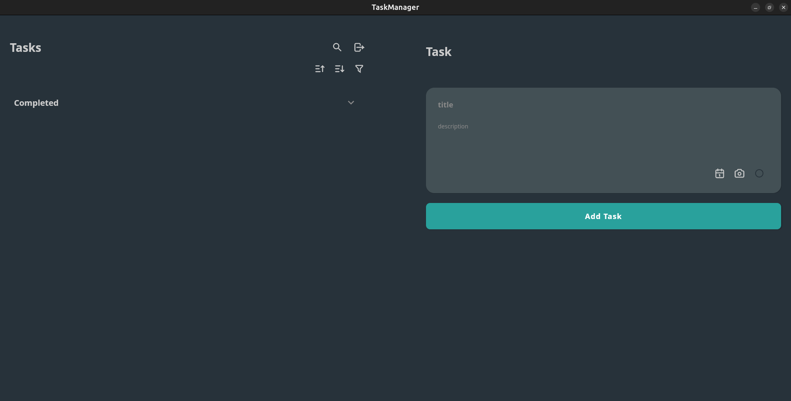
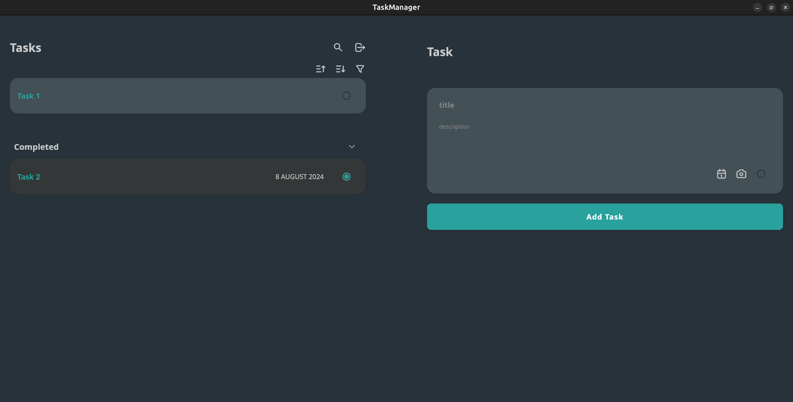
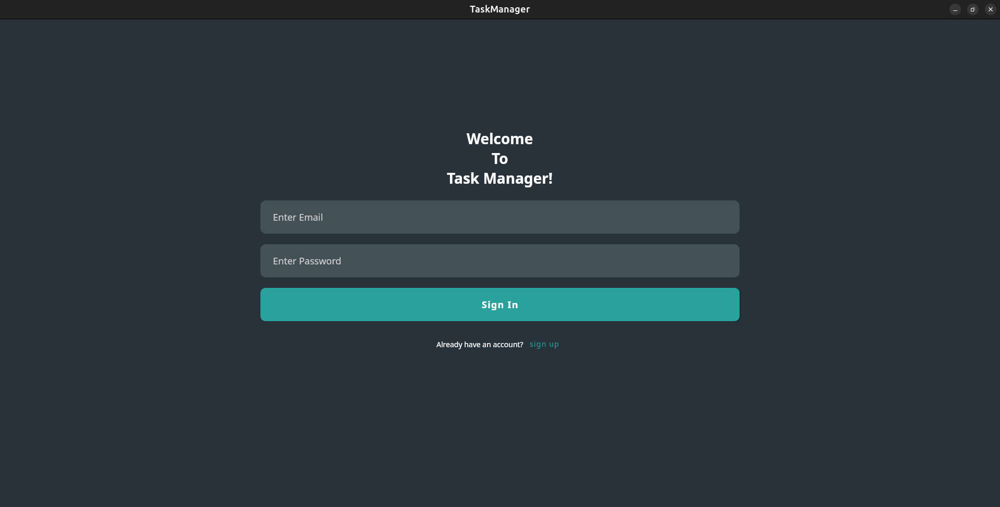
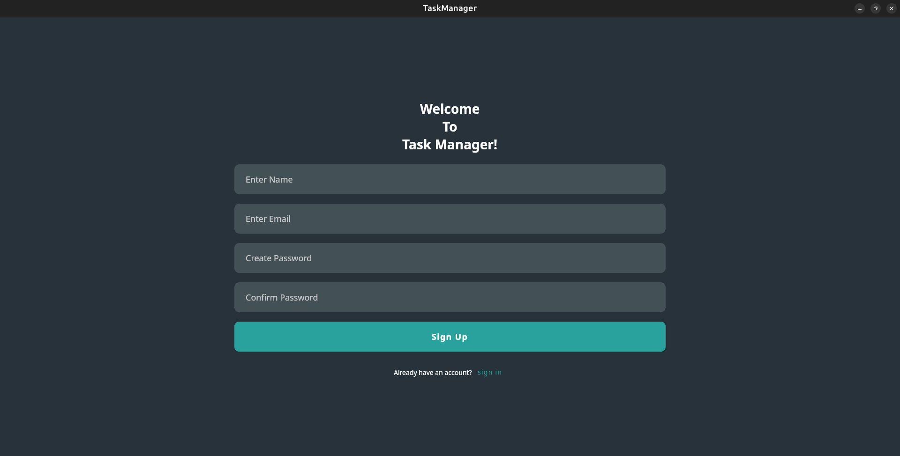

# Compose Multiplatform Task Manager

## Overview

Compose Multiplatform Task Manager is an application targeting Android and desktop platforms. The application allows multiple users to register, log in, and manage their tasks. Users can add, edit, remove, and mark tasks as completed. The tasks can be sorted by title and searched for easy access.

## Features

- **User Registration and Login:** Multiple users can register and log in.
- **Task Management:** Logged-in users can view, add, edit, remove, and mark tasks as completed.
- **Task Sorting and Searching:** Tasks can be sorted by title and searched based on text.
- **Persistence:** User and task data are stored using Room, and the logged-in user is stored using Datastore Preferences.
- **Dependency Injection:** Koin is used for dependency injection.
- **Navigation:** Compose Navigation is used for navigating between different screens.

## Technologies Used

- **Compose Multiplatform:** For building the UI on both Android and desktop platforms.
- **Room:** For storing user and task data.
- **Datastore Preferences:** For storing the logged-in user.
- **Koin:** For dependency injection.
- **Compose Navigation:** For navigating between screens.

## Screenshots

### Android

[//]: # (![Android Screenshot 1]&#40;images/android/add_task_android.png&#41;)

[//]: # (![Android Screenshot 2]&#40;images/android/add_task_android_2.png&#41;)

[//]: # (![Android Screenshot 2]&#40;images/android/sign_in_android.png&#41;)

[//]: # (![Android Screenshot 2]&#40;images/android/sign_up_android.png&#41;)

[//]: # (![Android Screenshot 2]&#40;images/android/task_list_2.png&#41;)

[//]: # (![Android Screenshot 2]&#40;images/android/task_list_android_1.png&#41;)

### Desktop

