# ZTaskManager - Compose Multiplatform

## Overview

**ZTaskManager** is a modern task management application built using **Compose Multiplatform**, targeting both **Android** and **Desktop** (JVM) platforms. It provides a seamless experience for users to manage their daily tasks with features like user authentication, task persistence, and an intuitive UI.

## Features

- **User Authentication:** Robust registration and login system allowing multiple users to manage their private task lists.
- **Task Management:** Full CRUD operations (Create, Read, Update, Delete) for tasks.
- **Task Status:** Mark tasks as completed or pending to track progress.
- **Search & Sort:** Easily find tasks using the search functionality and sort them by title.
- **Cross-Platform:** Shared business logic and UI code between Android and Desktop.
- **Local Persistence:** Data is securely stored locally using Room Database.
- **State Management:** Efficient state handling with Android Architecture Components (ViewModel).

## Technologies Used

- **Kotlin 2.0.0:** The primary programming language.
- **Compose Multiplatform (1.6.11):** For building reactive UIs for Android and Desktop.
- **Room Database (2.7.0-alpha05):** For local data persistence with KSP support.
- **Koin (3.6.0-Beta5):** A pragmatic lightweight dependency injection framework.
- **Jetpack Navigation Compose:** For navigating between different screens within the app.
- **Datastore Preferences (1.1.1):** For storing user preferences and session data.
- **Kotlinx DateTime (0.6.0):** For handling date and time operations across platforms.
- **Landscapist Coil (2.3.6):** For efficient image loading.
- **Tabler Icons:** Comprehensive icon set for a modern look.
- **KMP Date Time Picker:** For intuitive date and time selection.

## Screenshots

### Android

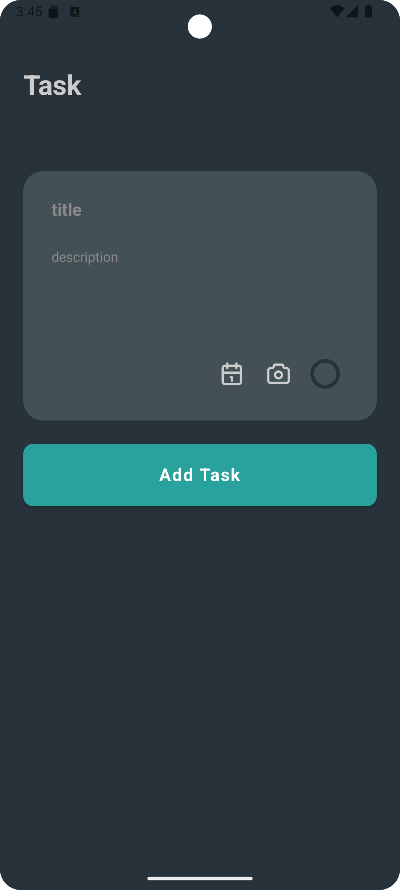 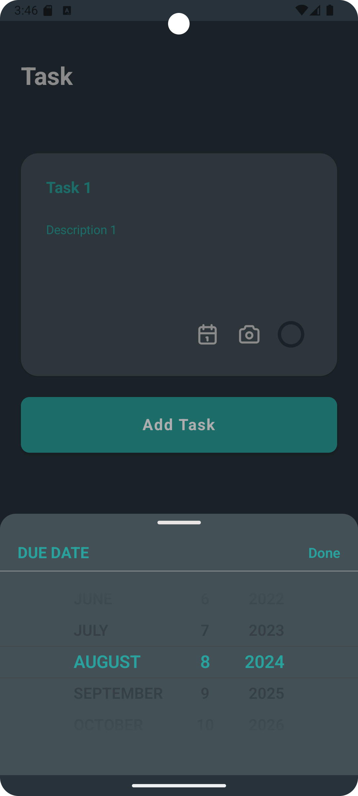 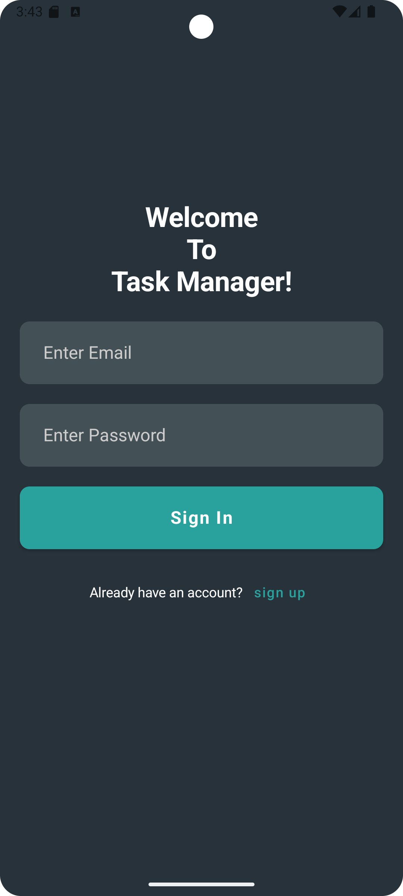 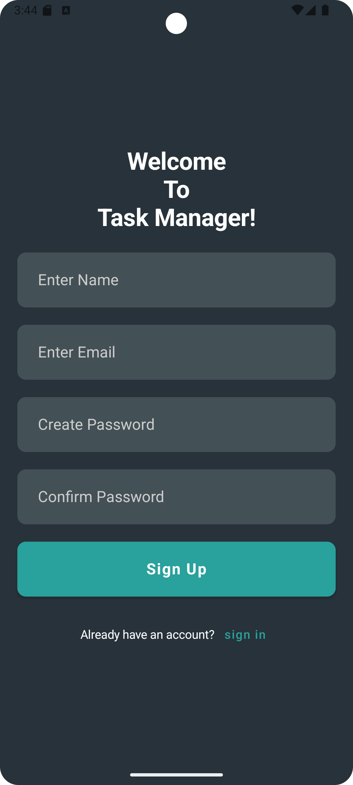 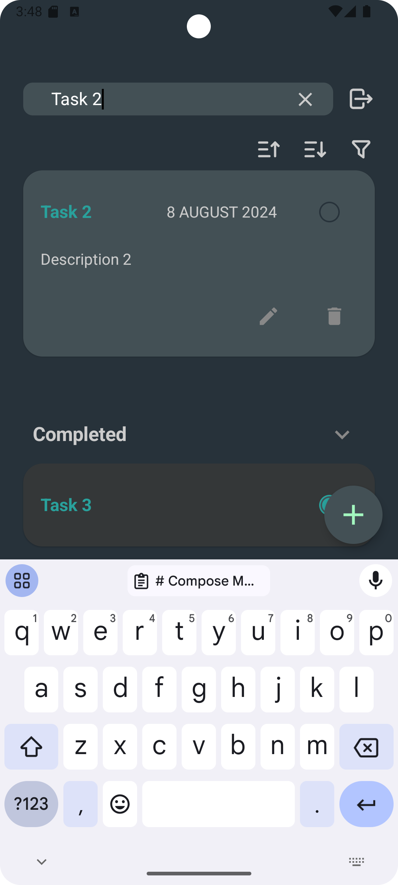 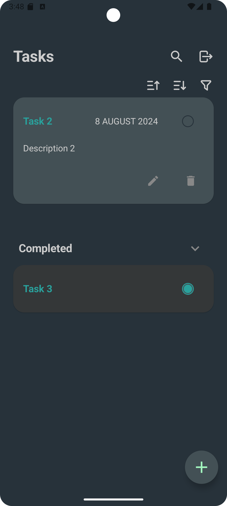

### Desktop

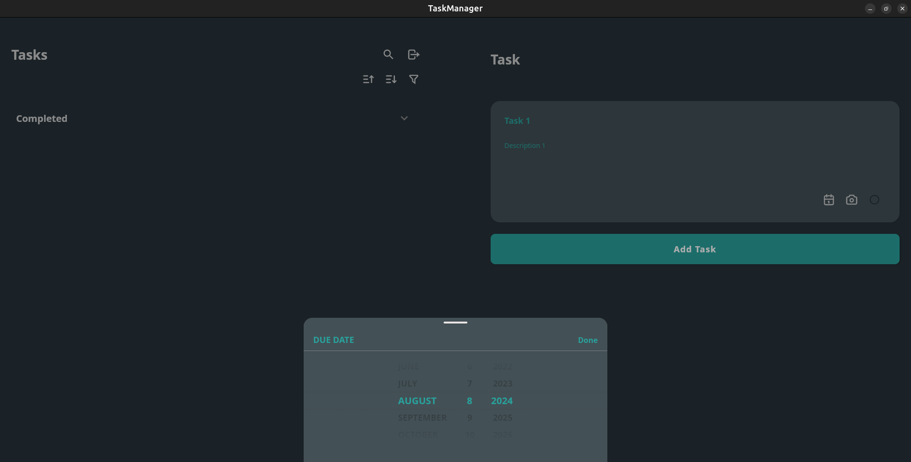 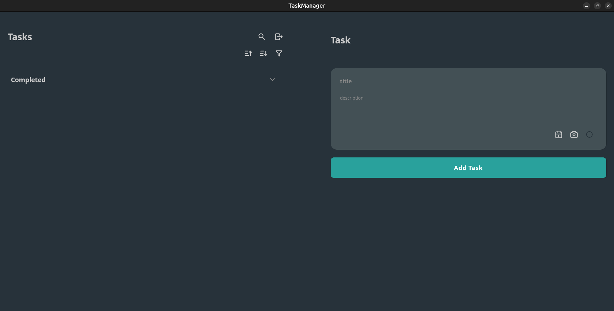 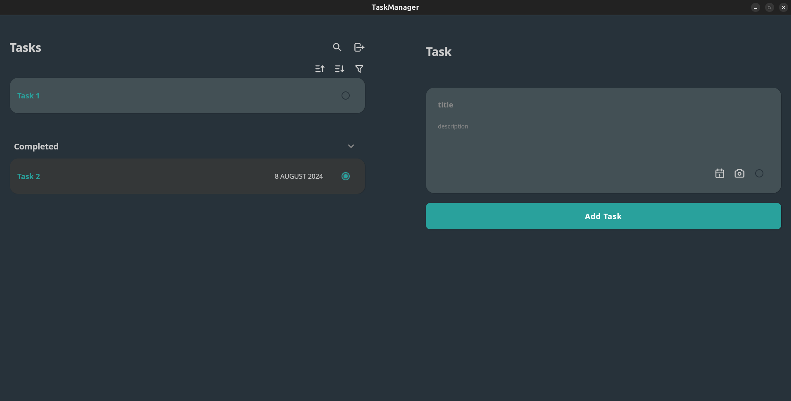 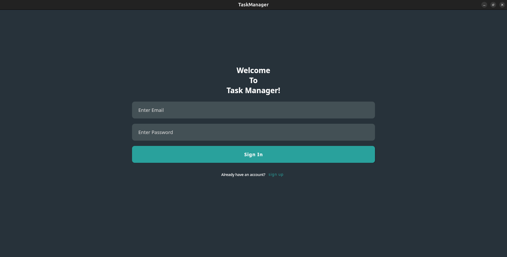 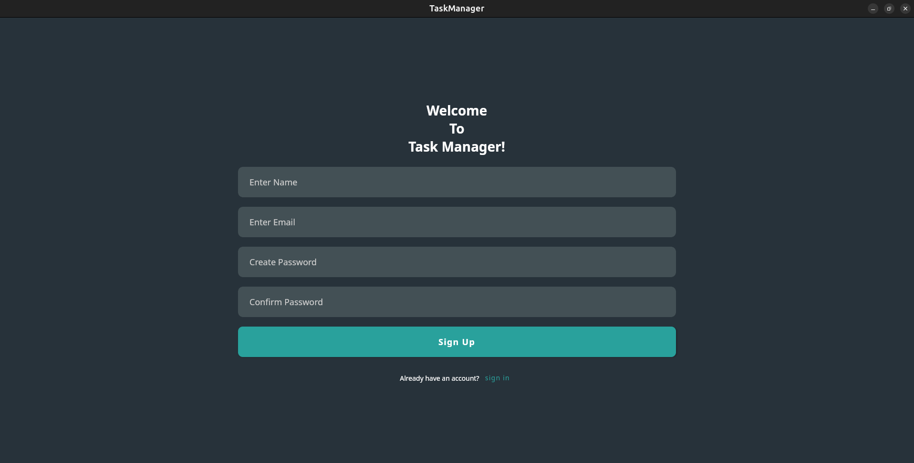

## Getting Started

### Prerequisites
- Android Studio (Koala or later) or IntelliJ IDEA.
- JDK 11 or higher.

### Running the App
- **Android:** Select the `composeApp` run configuration and target an Android device/emulator.
- **Desktop:** Run the `desktop` target from the Gradle tool window or use `./gradlew :composeApp:run`.
